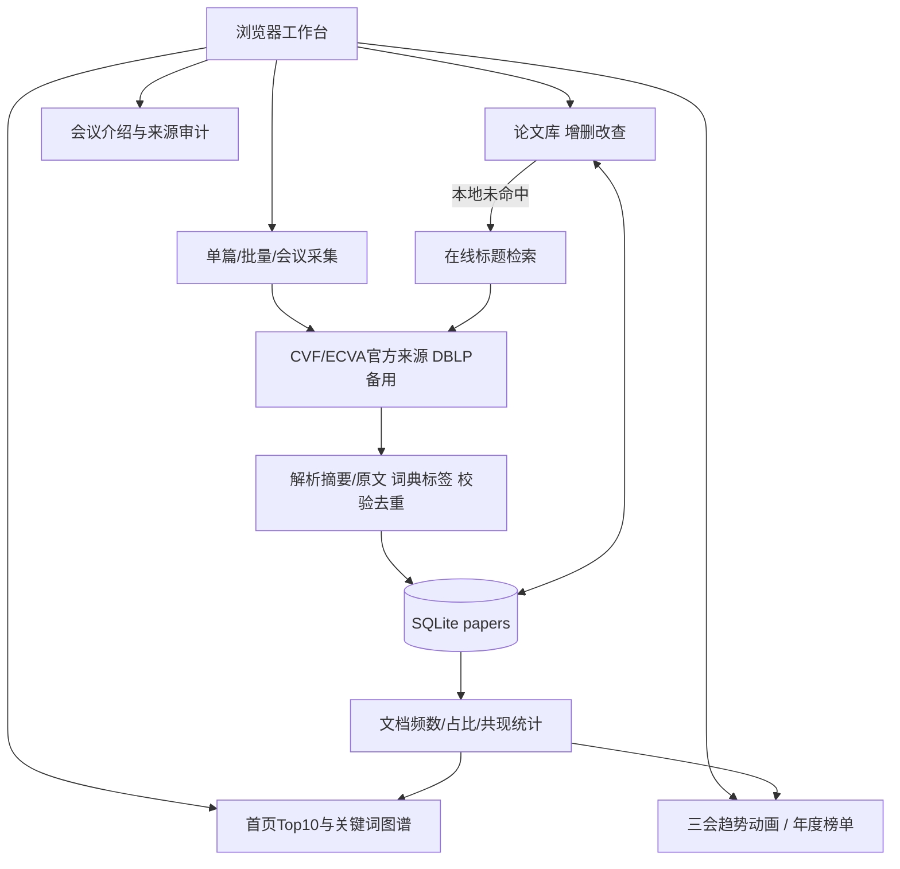

# 视界：与 AI 结对构建计算机视觉顶会热词平台

> **提交前状态说明**：这是依据真实项目生成的博客草稿。文中“待本人填写/待完成”必须在实际操作后补齐。尚未部署的云地址、尚未发布的原型、未发生的人工审阅和个人感想不能改写为完成。

| 这个作业属于哪个课程 | 待本人填写课程班级链接 |
|---|---|
| 学号-姓名 | 待本人填写 |
| 这个作业要求在哪里 | 待本人填写作业原文链接 |
| 这个作业的目标 | 与AI结对完成需求分析、专用工具原型、顶会论文管理与热点分析、测试及华为云部署，并反思人机协作 |
| 其他参考文献 | 《构建之法》第3/4/8章；CVF Open Access；ECVA；DBLP API；Node.js文档；Google JavaScript Style Guide |

**CodeArts 项目地址：待创建以本人学号命名的项目并填写实际链接。**

**AI 编程助手：Codex 桌面会话，本次系统标识 GPT-6，主要用于需求草稿、实现、测试、修复与文档。界面显示的具体版本以实际截图为准。**

## 目录

- [一、仓库、规范与AI说明](#repository)
- [二、PSP表格](#psp)
- [三、NABCD需求分析](#nabcd)
- [四、原型设计与链接](#prototype)
- [五、成品展示](#demo)
- [六、人机结对讨论与三个案例](#collaboration)
- [七、设计实现过程](#architecture)
- [八、关键代码与解释](#code)
- [九、测试与修复](#tests)
- [十、心路历程、收获](#reflection)
- [十一、对AI伙伴的评价](#evaluation)
- [十二、发布与提交核对](#submission)

## 一、仓库、规范与AI说明

项目名“视界 / Vision Trends”，面向刚进入计算机视觉领域的学生。用户先从Top10与共现图谱发现方向，再进入论文库读摘要、原文，也能导入自己的论文清单。技术栈为 Node.js 22 内置 HTTP、SQLite 和原生 JavaScript/SVG，没有第三方运行时依赖。

| 入口 | 实际地址/状态 |
|---|---|
| CodeArts 仓库 | 待本人填写 |
| 代码规范 | 仓库 `codestyle.md`，待替换为CodeArts可点击URL |
| 原型网页 | 待在Figma等工具发布后填写 |
| 华为云部署地址 | 待实际部署并外网验收后填写 |
| 本地启动 | `node scripts/seed.mjs` → `node src/server.mjs` → http://127.0.0.1:3000 |
| 版本 | 本地1.0.0；远端Release状态待核对 |

代码规范来源为 [Google JavaScript Style Guide](https://google.github.io/styleguide/jsguide.html)、[Node.js官方文档](https://nodejs.org/docs/latest-v22.x/api/) 和 [MDN](https://developer.mozilla.org/en-US/docs/Web/JavaScript)。

**贡献声明**：当前源码、测试和文档初稿主要由AI生成；Git使用 `Codex AI` 标记真实作者。学生实际编写/修改的文件、行和理由应在审阅后补充。目前不能声明“我已理解所有代码”或“我独立实现了某模块”。程序源码不是由原型工具导出。

## 二、PSP表格

预估在首个代码实现前记录并提交。下表是完成整个课程实践的时间预算，不是AI生成项目所花时间。本人实际工时需要从实际学习、设计、审阅、开发、部署与写作记录填写。

{{PSP_TABLE}}

**实际偏差分析（待本人写）**：我原估____分钟，实耗____分钟；最大的偏差在____，因为____。AI在____节省了____分钟，但____返工增加了____分钟。下次我会____。

AI工作区实际时间区间可从 `git log --format="%h %cI %s" --reverse` 核验。此区间包含等待、工具操作与文档制作，不能伪装成学生个人工时。

## 三、NABCD需求分析

{{NABCD}}

**阅读与人工复核待补**：阅读《构建之法》第3章、第8章后，补充我认为方案最不合理的一点____，最终修改为____，理由____。以上AI分析不等于本人已完成阅读。

## 四、原型设计与链接

拟使用 Figma 专用原型工具。项目提供原生 Frame/Text/Rectangle 生成插件，可创建总览、论文库、采集、趋势、年度演变、关于、详情、编辑、删除确认和关键词结果10张画板。统一采用浅灰底、深绿主色与暖色会议区分，强调信息层级和可追溯统计。

插件与说明见 `prototype/`。它生成的是可编辑设计稿，应用由 `src/` 与 `public/` 独立实现，未使用原型生成代码。

**当前尚未在Figma账号内运行/发布，原型网页链接：待实际操作后填写。**

主要交互规则：侧栏在各页一致；Top10与图谱节点跳到同关键词筛选结果；论文标题进入详情；新增/编辑显示表单，删除二次确认；查询无结果允许在线检索；趋势播放、暂停、滑块控制当前年份；年度榜单词条链接回论文库。

| 人工检查项 | 初稿问题 | 我的调整 | 原因与截图 |
|---|---|---|---|
| 图谱标签与布局 | 待本人实际检查 | 待填写 | 待填写 |
| 手机视口信息层级 | 待本人实际检查 | 待填写 | 待填写 |
| 查询空态/部分导入失败 | 待本人实际检查 | 待填写 | 待填写 |

需补：工具画板截图、交互连线截图、修改前后截图、发布链接与独立访问验证。不能把下面的统计配图当成原型截图。

## 五、成品展示

应用实现论文采集、论文管理、Top10、关键词图谱和多年度三会动画，并扩展年度榜单、CSV导出、会议介绍和来源审计。

以下素材直接使用应用统计模块导出的真实数据制作，是**统计结果图/GIF，不是浏览器界面截图**。189篇样本来自官方页面，目标192篇中的3次网络失败单独留痕。请在发布博客时上传图片/GIF到博客平台，调整地址，测试动图可播放。

### 5.1 Top10：从方向进入论文

图1：3D vision 在当前样本中命中47篇。一个词在同一篇摘要重复出现不会重复计数。成品中点击排行条目会进入相关文章列表。

### 5.2 关键词关系

图2：节点代表研究方向，连线表示同篇论文共现。此处为静态统计导出图；成品图谱节点可以点击，需要另补真实交互截图。

### 5.3 跨会议热度走势动图

动图1：逐年显示 Diffusion models 在三会样本中的占比；标签同时给出命中数/样本数。ICCV与ECCV的缺失届次不填零。虚线只连接已有观测，不提供缺失年份估计。

### 5.4 年度热门方向演变

动图2：每个年份重新统计Top10。某方向名次变化不必然意味着全领域趋势变化，也受到采样和词典影响。

### 5.5 年度结果分图

图3：2022年样本中的方向分布，作为后续比较起点。

图4：2023年榜单，包含当年已采集CVPR和ICCV论文。

图5：2024年榜单，包含CVPR和ECCV样本，注意会议组合与2023年不同。

图6：2025年榜单。比较时应同时查看每届样本量，不直接把排名当作学科评价。

### 5.6 趋势逐帧与完整比较

图7：动画起始帧，只显示已观测2022年数据。

图8：加入2023年CVPR和ICCV数据，保持相同纵轴便于比较。

图9：加入2024年ECCV和CVPR。虚线跨过未举办年份，不把空档降为零。

图10：加入2025年观测，完成四年比较。

图11：完整比较静态版，适合无法播放GIF的平台。它与图10相同视图，不能为了凑展示数量冒充另一个功能。

**必须补充实际界面展示**：新增/编辑/删除、精确与模糊查询、未命中在线回退、单篇与批量采集结果、图谱联动、手机视口。仅统计图不足以证明全部功能。`scripts/capture-browser.ps1` 可自动准备14类界面素材，但本会话浏览器IPC受限，尚未运行成功；也可以真实手动截图或录屏。

## 六、人机结对讨论与三个案例

### 6.1 协作事实

本会话真实用户提示词为“帮我完成作业的所有要求”，附完整作业要求。之后AI主动拆分、实现和自检。尚未出现学生多轮人工审阅，因此不能将此记录描述为已经满足“多次人机互动、本人采纳/拒绝”的全部评分要求。本人须实际参与下面三个案例，补真实提示词与截图。

### 案例A：需求和原型

AI把功能映射为六个导航页面与详情弹窗，给出NABCD和验收标准。主要设计决策是展示样本规模、来源和缺失状态，避免图表造成“完整会议统计”的错觉。原型交付为Figma可编辑画板插件；专用工具内的实际审阅、修改和发布待完成。

**本人参与待补**：我拒绝/修改AI的____建议，因为____；实际改动____；截图____。

### 案例B：采集与统计

在线探测时DBLP返回人机验证HTML而非JSON。AI将优先路径改为CVF/ECVA官方目录，DBLP作为备用定位，增加响应检查、限速缓存与错误报告。不是绕过验证，也没有编造摘要。

对关键词采用受控短语词典，合并常见变体，并按文档频数统计。优点是可以解释和修订；缺点是覆盖有限、多义词可能误判。官方摘要、词典标签和人工标签分别标识。

**本人参与待补**：抽查5篇来源与标签，发现____；我选择____改法，理由____；提示词与官方页面截图____。

### 案例C：实际Bug与修复

编辑表单声明“关键词留空自动提取”，但后端使用 `{ ...old, ...body }` 合并对象，省略keywords时旧标签被保留。回归测试首次失败，16项仅15项通过。

修复时在明确切回自动提取的请求中删除旧keywords字段，再交给数据层提取。修复后16项全通过，前后测试文件和两个提交保留在仓库。

此Bug由AI自检发现，不能写成我本人发现。本人需亲自复现，并解释“字段未传”和“请求自动重算”两种语义不同之处。

**本人复现、审阅与截图待补**：____。

完整事实记录、真实输出摘要和待执行提示词建议见 `docs/ai-collaboration.md`。所有对话截图都应从实际Codex界面截取，不制作仿对话图片。

## 七、设计实现过程

### 7.1 功能结构图

若博客平台不支持Mermaid，应导出真实架构图再上传，不能保留无法渲染的代码块。

### 7.2 数据模型与查询

`papers` 保存id、title、normalized_title、conference、year、abstract、authors、keywords、source_url、paper_url、keyword_method、retrieved_at、updated_at。唯一约束为规范化标题+会议+年份，避免同篇重复，同时保留跨会议/年份同名版本。

查询使用绑定参数；精确查询比较规范化标题，模糊查询匹配标题、摘要、关键词或编号；对LIKE通配符进行转义。手工编辑后再次采集不会覆盖已有修改。

### 7.3 数据流与失败处理

标题→官方目录定位→详情解析→校验→关键词提取→SQLite。抓取只允许官方HTTPS域名，不跟随任意重定向；设置20秒超时、32MB上限、400ms间隔和24小时缓存。批量最多30条，每条有成功/失败结果；摘要缺失如实标注，网络失败不生成替代内容。

189篇样本分布为CVPR 94、ICCV 47、ECCV 48。来源列表条目数与会议录取总数不一定一致，不对齐或改造官方数据来迎合作业示例。

### 7.4 图谱和动画

图谱取出现频数最高的最多16个词，节点大小与频数有关；每篇论文的标签两两配对累加边权，最多展示50条边。SVG节点支持点击和键盘进入论文列表。

趋势返回每会议每年份的count、percent、total和status。已采集但没有该词为0；未举办/未采集为null。前端播放定时推进滑块，切换路由清理定时器；避免多个页面动画继续占用资源。年度榜单每年重新排序。

### 7.5 部署设计

Docker以非root用户运行，SQLite保存在具名卷；容器启动幂等导入样本。公网监听要求至少16字符管理员口令，读接口公开，写接口验证Bearer token。默认本地监听127.0.0.1。服务器部署、端口和HTTPS按真实云环境设置，详见 `deploy/README.md`。

## 八、关键代码与解释

以下摘自最终源码，约300行；文件名标明模块，不把互相独立的片段误当作可直接合并运行的单文件。AI生成的代码同样需要本人解释。

{{KEY_CODE}}

**阅读后自测**：我能否不看AI解释，独立画出查询、抓取、去重、更新和统计的数据流？我能否说明null和0的差异，并手算两篇论文的共现边权？待本人实际完成后记录答案。

## 九、测试与修复

当前16项自动化测试通过，覆盖CRUD、持久化、去重、关键词边界、统计、缺失年份、CSV、官网解析、错误响应、访问权限和在线回退。`docs/test-before-fix.txt`与`docs/test-after-fix.txt`保留真实前后结果。

另外通过真实HTTP接口采集ICCV 2023《Segment Anything》，取得866字符官方摘要、关键词和PDF链接，随后精确查询命中。使用临时内存库，不修改正式样本；结果见 `docs/live-smoke.json`。首页与前端资源返回200，但资源可访问不等于浏览器交互已验收。

Node默认测试子进程受当前Windows管理环境限制，测试命令使用非隔离模式；测试数据库仍分别创建。运行时不用Python，Python仅用于可选图表导出。

浏览器渲染与交互截图尚未通过：Chrome、Edge及独立headless-shell启动受到Windows IPC限制。不能把HTTP测试或统计图视为真实浏览器验收。Figma执行与华为云部署也需要在本人实际环境验证。

## 十、心路历程、收获（必须本人写）

以下是写作引导，不是可直接提交的代写感想：

1. 阅读《构建之法》第4章后，我怎样理解驾驶员与领航员？本次我实际承担了哪些判断和审阅？
2. 哪一次AI输出让我误以为正确？我是怎样核实的？请给出具体输入、现象和证据。
3. 我在哪个模块从“能运行”进步到“能解释”？用一段自己的话说明设计。
4. 与最初预估相比，实际时间耗在哪？如果重做，我会改变哪一个协作步骤？
5. 如果换成人类结对伙伴，哪些沟通和相互负责的机制会不同？AI无法替我承担什么责任？

本人正文：____（建议400—700字，结合真实操作与截图）。

## 十一、对AI结对伙伴的评价（本人核实后改写）

可参考的具体事实：AI快速形成需求清单和跨模块实现，并用测试发现自己的标签更新Bug；面对DBLP人机验证调整了数据来源路径。但最初环境判断不完整，浏览器工具受限也没有完成UI视觉验收。一次大规模生成容易使学生缺少主动设计和审查，必须用实际修改与复现补上。

与人人结对相比，人机结对能快速给出多个候选方案和代码草稿，却不具备同学对课程上下文的共同经验，也不能替代学生对需求取舍、证据真实性和提交负责。AI可能产生幻觉、过时API、遗漏状态或安全问题；来源校验、测试和本人理解仍然必要。

本人评价：我采纳____，拒绝____；最大的贡献____，最明显的局限____；下一次我会要求AI先____，再____。

## 十二、发布与提交核对

- 在CodeArts以学号命名项目，推送真实历史，核对dev→main、15次以上commit、Issue/PR和1.0.0 Release。
- 实际使用专用原型工具并发布可访问链接，补设计过程与本人修改证据。
- 部署到华为云，给出真实公网URL和访问截图。
- 补真实界面展示、对话截图、个人PSP与感想，不把占位内容当完成。
- 发布博客后测试目录、图床、GIF和外部链接；在2026-09-24 23:59前通过课程页面提交，留意审核及班级群额外通知。

详细清单见 `docs/submission-checklist.md`。
