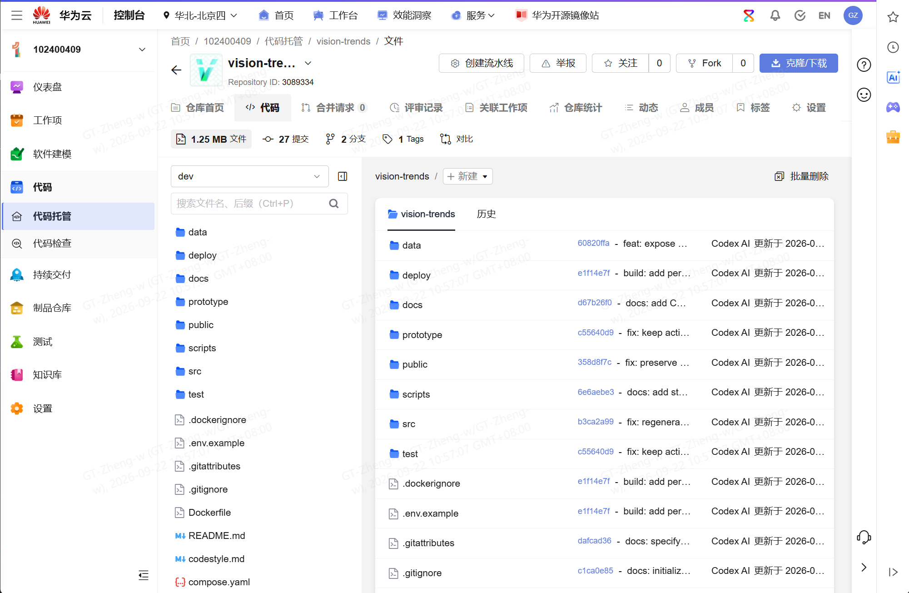
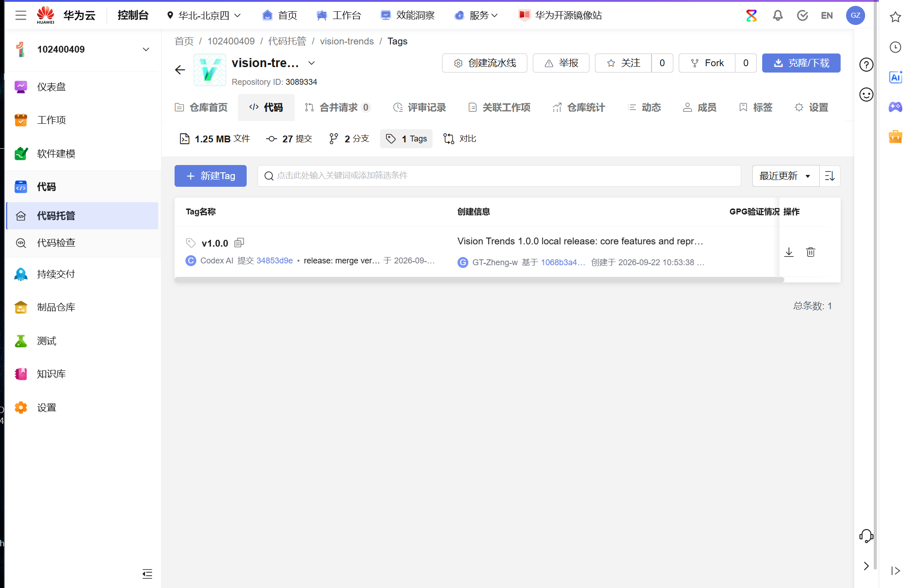
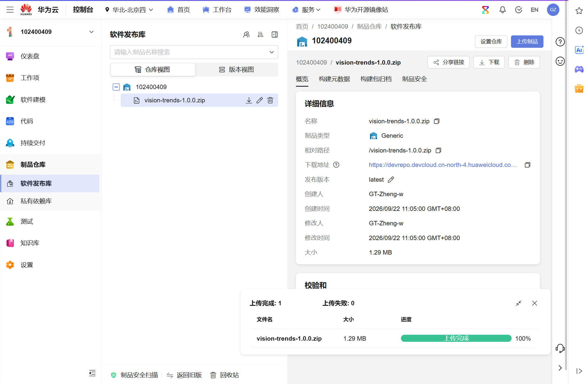
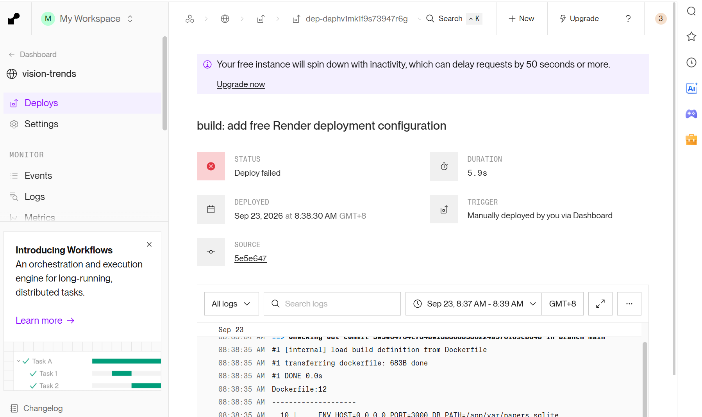
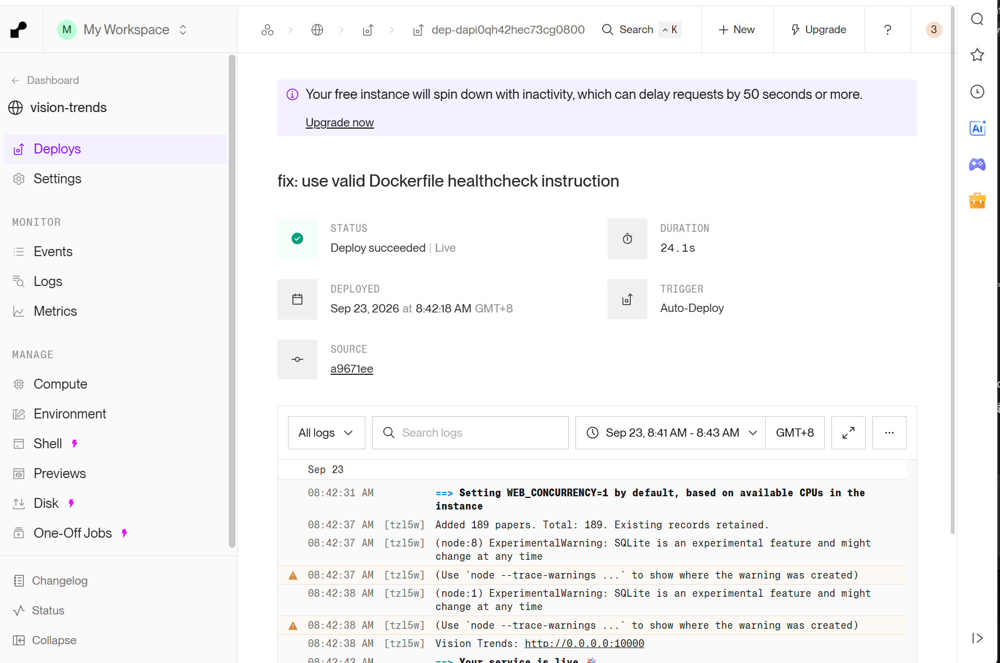
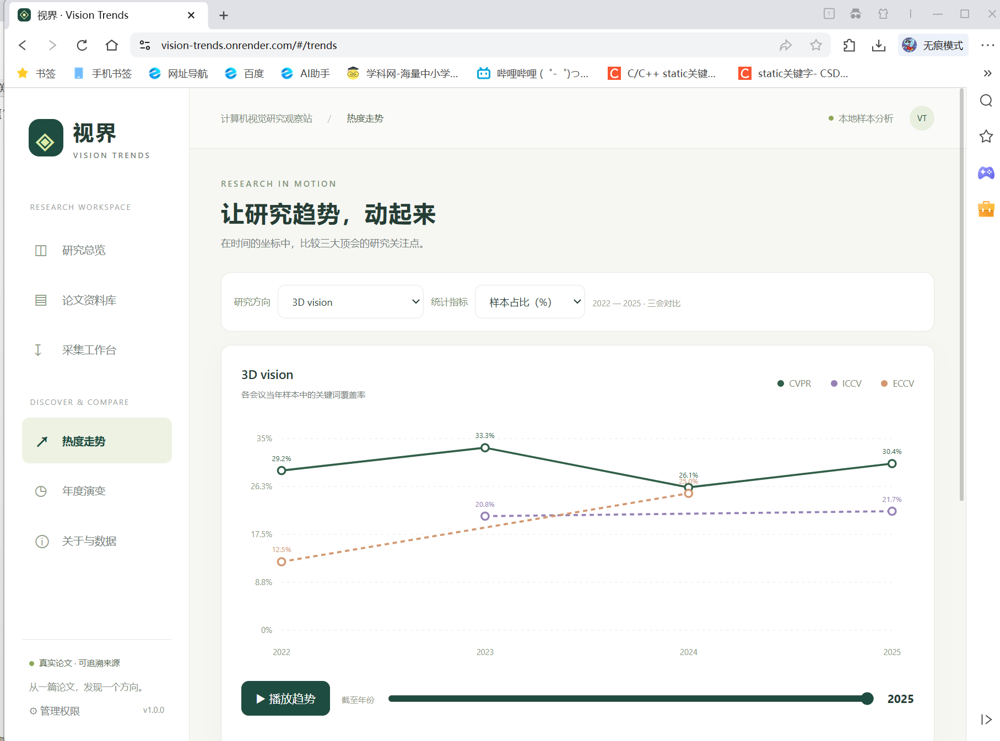

# 云端部署与真实证据

学生：102400409 郑雯心。部署地址：https://vision-trends.onrender.com/ 。博客平台：CSDN。

## 要求变化与选择

用户转述老师群通知：个人结对练习可自由选择其他免费或低成本云平台，无需强制华为云；后续团队项目仍须华为云。依此选用Render Free Docker Web Service，不购买ECS。通知目前只有用户转述文字，没有自行制作通知截图。

## 已发生事实

1. 用户在CodeArts项目102400409创建vision-trends，推送main、dev、v1.0.0，截图显示当时27次提交。
2. 用户将vision-trends-1.0.0.zip上传软件发布库；上传截图中的发布版本仍是latest，随后用户确认已修改为1.0.0，最终版本字段截图待补。
3. 用户用本机代理127.0.0.1:7892解决GitHub连接超时，上传两个分支和标签。CodeArts后续更新遇到HTTPS认证失败，因此GitHub与CodeArts当前未必一致。
4. AI提交5e5e647误将Dockerfile HEALTHCHECK写成CMD-SHELL，Render构建失败。这是AI引入的配置错误，之前的JavaScript语法检查及原型测试不能检出Dockerfile语法错误。
5. AI改为合法CMD语法，提交a9671ee；用户推送后，Render截图显示2026-09-23 08:42:18 +08:00部署成功，自动导入189篇论文。
6. 用户最新截图显示无痕窗口访问公网热度走势页面，曲线可见。截图不能证明所有写入和动画播放都通过。
7. AI随后直接发起4项无认证GET检查：/api/health、/api/papers?pageSize=1、/api/trends?keyword=3D%20vision、/api/config，全部200并通过基本响应断言。原始结果见cloud-readonly-check.json。没有调用云端写接口。

## 截图证据

文件来源、未加工声明与SHA256见evidence/manifest.json，均来自用户本会话上传的真实截图。

## 管理与验收边界

ADMIN_TOKEN由Render生成并保存在环境变量中。用户可自行在Render服务的Environment中复制它，在网站左下角“管理权限”粘贴保存；无需发给AI、不得写入代码或博客。随后可用临时测试论文完成新增、编辑、删除验证。

当前尚无云端CRUD、实时爬取、动画推进、重启持久化的完整浏览器自动化验收证据。Free实例的SQLite为临时磁盘，更新/重启可能重置，不能宣称云端永久保存数据。下载CSV可保留展示数据，但不等于完整数据库备份。Compose具名卷方案为另一种部署方式，本次Render没有使用该卷。
