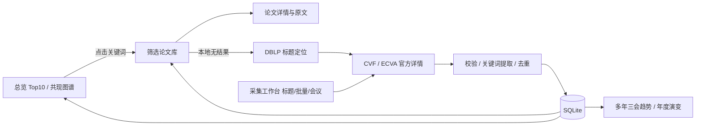

# 需求分析与验收

## NABCD

### N · Need

小刚不了解计算机视觉，想从近年顶会论文快速发现方向并定位可阅读论文。次要用户是选题学生和助教。主要场景为“看热点→点关键词→筛选会议/年份→读摘要与原文”，以及“导入导师推荐清单→补齐信息→管理个人文献库”。需要降低查找成本，同时避免让不完整样本生成看似权威的结论。当前为课程单用户项目，不包含商业推荐、全文语义搜索或用户权限体系。

### A · Approach（重点）

1. **可信入口**：CVF / ECVA 官方列表提供会议、年份、标题和详情地址；DBLP 补充按标题定位。按 HTTPS 域名白名单访问，不接受任意网络地址。
2. **统一数据**：SQLite 保存标题规范化键、会议、年份、摘要、提取词、来源、原文和采集时间。按规范化标题+会议+年份去重，保留不同版本；缺失摘要明确显示。
3. **可解释统计**：英文短语词典合并 diffusion / diffusion models 等变体。一个关键词在同一篇论文只计一次；热度=命中论文数/当前筛选样本论文数×100%，Top 10 按文档频数排序。允许人工编辑词。避免词典外方向被误认为不存在，博客说明局限。
4. **交互闭环**：首页 Top 10 和图谱点击进入论文列表；搜索本地未命中时显式提示并进行在线标题定位；批量抓取逐条显示结果；删除二次确认；趋势提供计数与占比、播放/暂停、时间滑块及 CSV。
5. **实现策略**：Node.js 内置 HTTP 和 SQLite，前端原生 SVG 图表；浏览器不依赖远程 CDN，样本离线可演示，在线抓取需要网络。五类必需页面加年度演变页面。
6. **评价指标**：自动化验证增删改查、去重、无数据、异常输入；浏览器验证所有页面和图谱联动；用实际页面截图和动画说明功能。抓取失败返回失败，不返回虚构摘要。

### B · Benefit

用户无需逐篇手动打开论文页，可以集中查看方向和相关论文。占比指标降低不同采集量的直接影响，但不能消除抽样偏差；明确展示样本规模，帮助用户合理解释结果。收益是流程步骤减少和可追溯性提高，未进行用户实验，不声称节省了具体百分比时间。

### C · Competition（重点）

| 产品/方式 | 已有优势 | 本项目选择的差异 | 本项目不足 |
|---|---|---|---|
| Google Scholar | 广泛覆盖、引用与检索 | 聚焦三会+年度方向可视化+个人库编辑 | 无法替代全面检索与引用指标 |
| Semantic Scholar | 大规模语义检索、关联推荐 | 无密钥离线演示、展示具体统计公式 | 词典提取覆盖率远低于大模型语义理解 |
| DBLP | 书目信息可信、开放 API | 补充官方摘要、方向共现与动态比较 | 依赖外部网站、摘要缺失不可避免 |
| CVF / ECVA 官方列表 | 来源权威、原文便利 | 跨会议跨年份统一检索和可视化 | 采集样本不等于完整会议语料 |
| Excel 手工汇总 | 灵活可编辑、门槛低 | 自动定位、持久化、查询联动、动画 | 开发维护成本更高 |

这些对比为公开功能层面的分析草稿，不是实际竞品评测报告。竞争方式是服务“初学者快速进入领域”这一窄场景，不宣称全面超越成熟平台。人工应核对公开功能和自身真实使用体验。

### D · Delivery

通过 CodeArts 管理源码和版本，在华为云 ECS 部署容器；博客附原型链接、部署 URL、Git 仓库、演示截图/GIF。班级内以“从零认识扩散模型方向”的路径演示。访问端不需注册，写入端使用部署者口令。收集反馈后增加词典或语义提取，保留统计版本说明。

## 优先级与验收矩阵

| 编号 | 优先级 | 用户操作与可核验结果 |
|---|---|---|
| F1 | P0 | 单个标题/每行标题/TXT/CSV 导入，逐篇获得官方摘要、提取词和原文；失败逐条报告 |
| F2 | P0 | 新增、编辑、删除持久化；精确标题/模糊标题、ID、摘要、关键词；未命中可自动联网返回 |
| F3 | P0 | 按会议/年份筛选后 Top 10 与样本量重新计算，重复词不重复计篇 |
| F4 | P0 | 图谱节点大小反映文档频数，连线表示同篇共现；点击打开相关文章 |
| F5 | P0 | 仅 CVPR/ICCV/ECCV 多年对比；播放/暂停和逐年查看；缺失会议年不补零 |
| E1 | P1 | 关于页面介绍三会、数据来源、公式、抽样偏差及关键词局限 |
| E2 | P1 | 年度 Top 10 动态演变，年度滑块与详情联动 |
| E3 | P1 | CSV 导出、原始来源审计、移动端布局与写操作保护 |
| P1 | 必需外部 | 专用原型工具内创建/导入并定义交互，实际发布可访问链接 |
| D1 | 必需外部 | CodeArts 以学号命名项目，dev→main、15次以上真实commit、1.0.0 Release |
| D2 | 必需外部 | 华为云真实部署，公网健康检查通过，博客给出URL |

## 页面与状态

导航：首页总览 / 论文库 / 采集工作台 / 趋势比较 / 年度演变 / 关于。详情用独立路由。状态必须包括加载、空结果、网络失败、摘要缺失、权限不足和导入部分成功。统一筛选逻辑：页面显式显示会议、年份、关键词和样本数。

## 与《构建之法》的对应阅读任务

学生需实际阅读第3章、第8章并将 NABCD 与书中概念对应，阅读第4章后比较驾驶员/领航员分工与人机审阅责任。以上是分析草稿，不代表学生已完成阅读，也没有虚构页码或引用。
